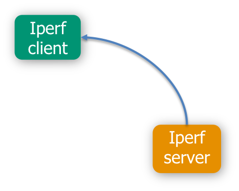

# Use case example

In this page there is a full real use case example explaining how the deployment process works, step by step. We assume that the NFVO and the Generic VNFM are running ready to receive invocations.

What is going to be deployed is shown in the following picture, an [Iper][iperf] client and an Iperf server.



As shown in the picture, the iperf server is the source of the dependency and the client is the target. Indeed is the client that needs the ip from the server. The semantic of the vnf dependency is: the source provides some parameters to the target.

Before starting we need to send the VimInstance to the NFVO and the Network Service Descriptor. For doing this please have a look into the [Vim instance documentation][vim-doc], [VNF Package documentation][vnf-package] and [Network Service Descriptor documentation][nsd-doc]. In fact, for creating a Network Service Record, we need to have a Network Service Descriptor onboarded into the catalogue with two Virtual Network Functions (iperf client and server) created from a VNF Package. A Virtual Network Descriptor for Iper client is shown:

```json
{
    "vendor":"fokus",
    "version":"0.1",
    "name":"iperf-client",
    "type":"client",
    "endpoint":"generic",
    "vdu":[
        {
            "vm_image":[
                "ubuntu-14.04-server-cloudimg-amd64-disk1"
            ],
            "computation_requirement":"",
            "virtual_memory_resource_element":"1024",
            "virtual_network_bandwidth_resource":"1000000",
            "lifecycle_event":[

            ],
            "vimInstanceName":"vim-instance",
            "vdu_constraint":"",
            "high_availability":"ACTIVE_PASSIVE",
            "scale_in_out":2,
            "vnfc":[
                {
                    "connection_point":[
                        {
                            "virtual_link_reference":"private"
                        }
                    ]
                }
            ],
            "monitoring_parameter":[
                "cpu_utilization"
            ]
        }
    ],
    "virtual_link":[
        {
            "name":"private"
        }
    ],
    "connection_point":[

    ],
    "lifecycle_event":[
        {
            "event":"INSTANTIATE",
            "lifecycle_events":[
                "install.sh"
            ]
        },
        {
            "event":"CONFIGURE",
            "lifecycle_events":[
                "server_configure.sh"
            ]
        }
    ],
    "vdu_dependency":[

    ],
    "monitoring_parameter":[
        "cpu_utilization"
    ],
    "deployment_flavour":[
        {
            "df_constraint":[
                "constraint1",
                "constraint2"
            ],
            "costituent_vdu":[

            ],
            "flavour_key":"m1.small"
        }
    ],
    "manifest_file":""
}
```

This is a perfect example for a dependency. The VNFManager Generic, when will handle the client VNF described below, will run the `install.sh` script during the instantiate method. The install.sh script is:

```bash
#!/bin/bash

sudo apt-get update && sudo apt-get install -y iperf screen
```

As said before in the documentation [VNFManager Generic][vnfm-generic], _the scripts in the CONFIGURE lifecycle event need to start with the type of the source VNF followed by \_ and the name of the script_, so the server_configure.sh is:

```bash
#!/bin/bash

screen -d -m -S client iperf -c $server_private1 -t 300
```

These scripts showed above, are contained into the VNF Package or into a git repository accessible from the VM. Once all these steps are done we are ready to create a Network Service Record from the id of the Network Service Descriptor. 

Let's again have a look into the sequence diagram of a create Network Service Record operation.


<!---
References
-->

[vnfm-generic]: vnfm-generic
[nsd-doc]:ns-descriptor
[vnf-package]:vnfpackage
[vim-doc]:vim-instance-documentation
[iperf]:https://iperf.fr

<!---
Script for open external links in a new tab
-->
<script type="text/javascript" charset="utf-8">
      // Creating custom :external selector
      $.expr[':'].external = function(obj){
          return !obj.href.match(/^mailto\:/)
                  && (obj.hostname != location.hostname);
      };
      $(function(){
        $('a:external').addClass('external');
        $(".external").attr('target','_blank');
      })
</script>